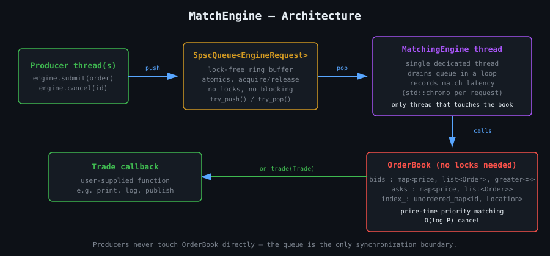
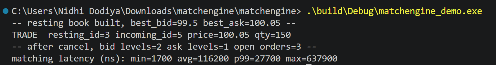
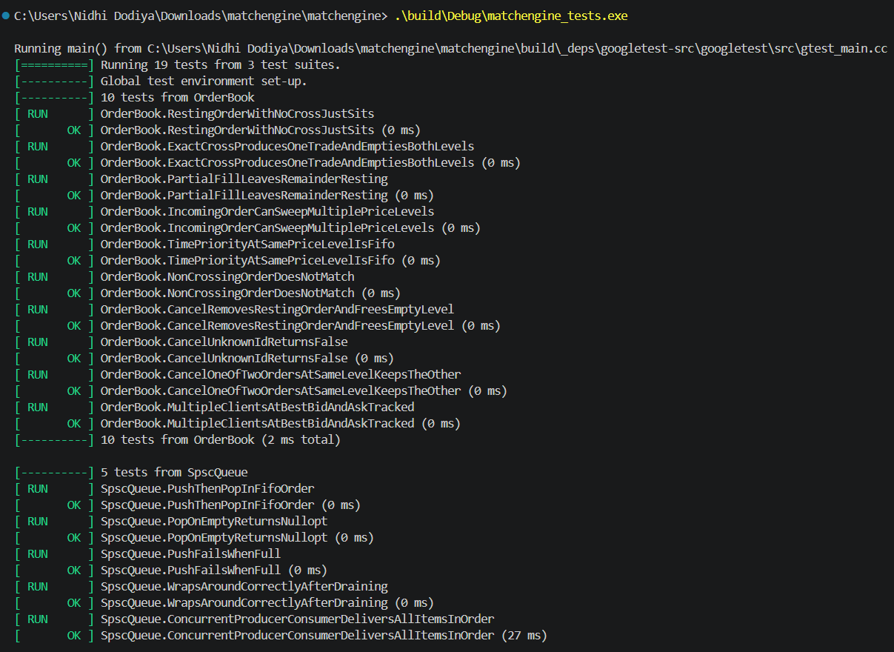
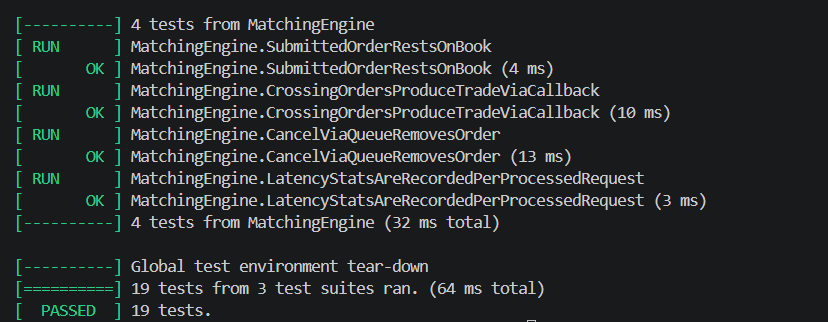
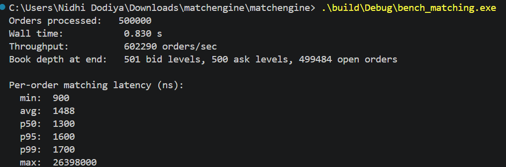

# MatchEngine

A limit order book and matching engine, built from scratch in C++20 —
price-time priority matching, O(log P) cancel, and a single-threaded book
fed through a lock-free SPSC queue, the same architectural pattern real
trading venues use to keep matching latency predictable.

Built as a portfolio project targeting a C++ systems-engineering role at
a trading technology company — specifically to demonstrate the domain
this kind of role actually works in (order books, price-time priority,
low-latency concurrency), rather than a general-purpose systems project.

See [`docs/architecture.md`](docs/architecture.md) for the full design
rationale, including a discussion of where the tail latency in
the benchmark actually comes from.

## Architecture



Producer threads never touch `OrderBook` directly — they push a request
onto a lock-free SPSC queue and return immediately. A single dedicated
thread drains that queue and is the *only* thread that ever calls into
the book, so the matching logic itself never needs a lock.

## What's implemented

- **Order book**: limit orders, price-time priority matching, partial
  fills, multi-level sweeps, O(log P + 1) cancel via a side-index.
- **Concurrency model**: single-threaded matching engine (no locks in the
  hot path) fed by a lock-free SPSC ring buffer for order entry/cancel.
- **Latency instrumentation**: per-order matching latency captured with
  `std::chrono`, reported as min/avg/p50/p95/p99/max.
- **Testing**: 19 GoogleTest cases — correctness (crossing, partial
  fills, FIFO time priority, multi-level sweeps, cancel), the SPSC queue
  (including a real concurrent producer/consumer stress test), and the
  engine end-to-end across the thread/queue boundary.
- **Benchmarking**: a synthetic order-flow generator mixing resting and
  crossing orders, reporting throughput and latency percentiles.

## Project structure

```
MatchEngine/
├── assets/                    Architecture diagram + screenshots (this README)
├── include/
│   ├── order.hpp               Order/Trade types, integer price ticks
│   ├── order_book.hpp          OrderBook: price-time priority matching, O(log P) cancel
│   ├── spsc_queue.hpp          Lock-free single-producer/single-consumer ring buffer
│   ├── matching_engine.hpp     Runs one OrderBook on one thread, fed by the SPSC queue
│   └── latency_stats.hpp       min/avg/percentile latency tracking
├── src/
│   ├── order_book.cpp
│   └── main.cpp                Demo: builds a small book, shows a cross, a cancel
├── tests/                     19 GoogleTest cases across all three components
├── benchmarks/
│   └── bench_matching.cpp      Throughput + latency percentiles under synthetic flow
├── docs/
│   └── architecture.md         Design rationale — read this before an interview
└── CMakeLists.txt
```

## Quick start

```bash
cmake -S . -B build -DCMAKE_BUILD_TYPE=Release
cmake --build build -j$(nproc)

./build/matchengine_demo      # small end-to-end demo with printed trades
./build/matchengine_tests     # 19 tests
./build/bench_matching        # throughput + latency benchmark
```

GoogleTest is pulled automatically via CMake `FetchContent` on first
configure (needs network access once). No other external dependencies.

## Sample output

**Demo** — a small resting book, then a crossing order, then a cancel:



```
-- resting book built, best_bid=99.5 best_ask=100.05 --
TRADE  resting_id=3 incoming_id=5 price=100.05 qty=150
-- after cancel, bid levels=2 ask levels=1 open orders=3 --
matching latency (ns): min=1700 avg=116200 p99=27700 max=637900
```

**Tests** — all 19 passing, including the concurrent SPSC stress test:




```
[==========] Running 19 tests from 3 test suites.
...
[  PASSED  ] 19 tests.
```

**Benchmark** — throughput and latency percentiles under synthetic order flow:



```
Orders processed:   500000
Throughput:          602,290 orders/sec
Per-order matching latency (ns):
  min:  900    p50:  1300
  avg:  1488   p95:  1600
               p99:  1700
```

(Debug build on Windows/MSVC — a Release build with `-O2`/`/O2` optimizations
would be meaningfully faster; see `docs/architecture.md` for why the `max`
figure specifically runs much higher than everything else.)

## License

MIT — see `LICENSE`.
